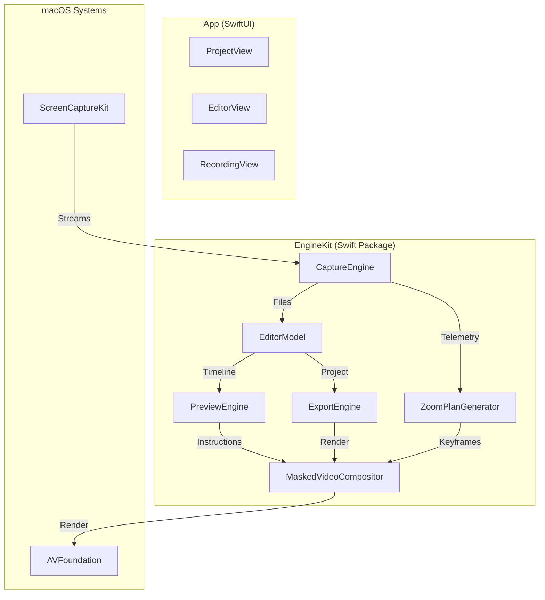

# Cameraman — Developer Onboarding

**Versión**: 0.6.1-dev | **macOS 13+** | **Swift 5.9+** | **Última actualización**: 2026-05-19

---

## ¿Qué es el proyecto?

Cameraman es una app nativa macOS para grabar pantalla + cámara + audio como pistas separadas, editarlas en un timeline no-destructivo, y exportar a MP4/GIF con efectos por segmento.

**Estado actual**: Beta funcional. Grabación, edición, export y auto-zoom funcionan end-to-end. Activamente en desarrollo.

---

## Setup en 5 minutos

### Requisitos
- macOS 13+ (Ventura)
- Xcode 15+
- Swift 5.9+

### Correr la app
```bash
open CameramanApp/CameramanApp.xcodeproj
# Scheme: CameramanApp → Destination: My Mac → Cmd+R
```

Al iniciar por primera vez, la app pide permisos de Screen Recording, Camera y Microphone. Acéptalos todos.

### Build/test del engine solo
```bash
cd EngineKit
swift build              # build debug
swift build -c release   # build release
swift test               # todos los tests (~32K LOC de tests)
swift test --filter ZoomPlanGeneratorTests  # test específico
```

---

## Arquitectura del proyecto

```
cameraman/
├── App/Sources/Cameraman/       ← SwiftUI app (~16K LOC)
├── EngineKit/Sources/EngineKit/ ← Engine Swift Package (~22K LOC)
│   ├── Capture/                 ← Grabación (screen, camera, mic, telemetry)
│   ├── Editor/                  ← Modelo de edición no-destructivo
│   ├── Preview/                 ← Playback con edits aplicados
│   ├── Export/                  ← Export MP4/GIF en background
│   ├── Zoom/                    ← Pipeline auto-zoom desde telemetría
│   ├── Transcription/           ← STT offline (Whisper.cpp)
│   ├── Intelligence/            ← Servicio AI (actor)
│   ├── Shared/                  ← Compositor, AudioMixBuilder, CompositionBuilder
│   ├── Store/                   ← Persistencia de proyectos (ProjectStore)
│   ├── Queue/                   ← Job queue para tareas de background
│   ├── Library/                 ← Listado, búsqueda, tags (ProjectLibrary)
│   └── Models/                  ← Tipos core: Project, Timeline, Clip, Overlay
└── CameramanApp/                ← Xcode project + entitlements
```

### Diagrama de Arquitectura



---

## Modelo de datos

El tipo central es `Project` — toda la información de edición vive en `project.json` dentro de la carpeta del proyecto. Los archivos fuente (screen.mov, camera.mov, etc.) nunca se modifican.

### Timeline multi-track (v0.5.0+)
```
Project.timeline.tracks: [TimelineTrack]
  ├── primary track  → RecordingClipRef (segmentos de grabación)
  ├── video tracks   → VideoClipRef, ImageClipRef, ColorClipRef (B-roll, imágenes)
  └── audio tracks   → AudioClipRef (música importada)
```

Cada clip es un `TimelineClip` con `ClipContent` enum (`.recording`, `.image`, `.video`, `.audio`, `.color`).

**Compat backward**: `project.timeline.segments` es un computed property que mapea el primary track a `[Timeline.Segment]` para código legacy.

### Estructura en disco
```
Projects/<project_id>/
├── project.json        ← metadata + timeline + overlays + canvas
├── sources/            ← screen.mov, camera.mov, mic_audio.m4a, system_audio.m4a
├── telemetry/          ← cursor.jsonl, keys.jsonl
├── proxies/            ← versiones low-res para preview fluido
├── cache/              ← thumbnails, waveforms
├── renders/            ← exports
└── transcript/         ← transcript.json, captions.srt/.vtt
```

---

## Patrones de diseño clave

### 1. Actor model para estado mutable
`CaptureEngine`, `CameraEngine`, `PreviewEngine`, `ThumbnailCache`, `AIService` son Swift actors. El código del engine no tiene `@MainActor` — la UI sí.

### 2. ProjectEditor (UI wrapper)
`ProjectEditor` es un `@MainActor ObservableObject` que envuelve `EditorModel` (actor). Maneja undo/redo con snapshots y autosave con debounce de 1s.

```swift
// Patrón para mutaciones de canvas
await projectEditor.applyCanvasUpdate {
    $0.canvas.layout = newLayout
}
// → graba undo snapshot, persiste, notifica UI
```

### 3. Job queue para tareas pesadas
Export, transcripción y generación de proxies corren como `Job` en `JobQueue`. No bloquean el thread principal.

### 4. Pipeline de zoom
```
Telemetría (cursor.jsonl)
  → TelemetryParser (click windows)
  → DwellDetector (pausas del cursor >300ms)
  → ZoomSuggestionEngine (merge/dedup)
  → ZoomPlanGenerator (keyframes con easing)
  → MaskedVideoCompositor (transform por frame)
```

### 5. Compositor personalizado
`MaskedVideoCompositor` implementa `AVVideoCompositing`. Renderiza en cada frame: PiP de cámara, zoom, efectos visuales (corner radius, shadow, padding, gradientes), overlays, captions.

### 6. Audio por pista
`AudioMixBuilder` construye `AVMutableAudioMix` con volumen/mute independiente por pista (recording + imported audio clips). Se usa en preview y en export.

### 7. Color / theming (Light + Dark)
La app sigue la apariencia del sistema por defecto; el usuario puede forzar Light/Dark en **Preferences → General → Interface** (`AppAppearance`, vía `NSApp.appearance`). Usa la paleta semántica `AppColor` (`Theme/AppColor.swift`) para el *chrome* de UI; deja fijos los colores sobre contenido (video, píldoras de color, teleprompter) y el color del usuario (`Color(hex:)`). Reglas completas en [`UI_THEMING.md`](UI_THEMING.md).

---

## Features implementadas (v0.5.1)

### Grabación
- Screen via ScreenCaptureKit (display/ventana/área)
- Camera overlay (track separada)
- System audio + mic (tracks separadas)
- Telemetría cursor/click para auto-zoom
- Hotkeys configurables
- Detección de fallos del AVAssetWriter con abort temprano

### Timeline y edición
- Multi-track: primary + video + audio tracks
- Operaciones: trim-in, trim-out, split, delete, deleteRange, addSegment
- Per-segment: speed (0.25x–4x), camera PiP position, volume (0–300%), mute
- Undo/redo (snapshot-based, 50 niveles) + autosave 1s
- Import de imágenes, video clips y audio al timeline
- Drag & drop para reposicionar media items

### Overlays y efectos visuales
- Tipos: arrow, rect, line, text — con timing (start/end), transform, style, animation
- Canvas effects: background solid/gradient/blur, corner radius, shadow, padding
- Camera PiP: 4 formas (circle, rounded rect, capsule, rectangle), border (width + color)
- Captions (SRT/VTT) con estilos configurables

### Auto-zoom
- Sugerencias automáticas desde telemetría de cursor (click windows + dwell detection)
- Markers en timeline, aceptar/rechazar individualmente
- Zoom plan con keyframes y easing aplicado en preview y export

### Preview y playback
- `PreviewEngine` (actor) con AVPlayer + MaskedVideoCompositor
- Proxy generation en background para playback fluido
- Thumbnails y waveforms cacheados con LRU eviction
- Per-track volume sliders en tiempo real

### Export
- **Web 1080p H.264** — web sharing
- **High 1080p HEVC** — calidad/tamaño optimizado
- **4K HEVC** — 3840×2160, 60fps, 30Mbps
- **Portrait 1080p H.264** — formato vertical
- **Animated GIF** — configurable fps, max-size, loop
- Per-segment camera positions, visual effects, audio incluidos

### Transcripción
- `TranscriptionEngine` — STT offline vía Whisper.cpp
- Genera transcript.json + captions.srt/vtt
- Export de captions como TXT/SRT/VTT

---

## Puntos de entrada recomendados

Para entender el proyecto rápido, leer en este orden:

1. **`Models/Project.swift`** — el modelo central; todo parte de aquí
2. **`App/Sources/Cameraman/ProjectEditorView.swift`** — layout de 3 paneles de la UI
3. **`App/Sources/Cameraman/ProjectEditor.swift`** — wrapper de edición con undo/redo
4. **`Editor/EditorModel.swift`** — lógica de edición (actor)
5. **`Preview/PreviewEngine.swift`** — playback con edits aplicados
6. **`Shared/MaskedVideoCompositor.swift`** — el corazón del render por frame

---

## Sandbox y permisos

La app corre con App Sandbox. Entitlements en `CameramanApp/CameramanApp.entitlements`:
- `com.apple.security.device.camera`
- `com.apple.security.device.audio-input`
- `com.apple.security.files.user-selected.read-write`
- `com.apple.security.files.downloads.read-write`

Info.plist: `NSCameraUsageDescription`, `NSMicrophoneUsageDescription`, `NSScreenCaptureUsageDescription`.

Proyectos guardados en:
`~/Library/Containers/dev.dpeluche.CameramanApp/Data/Library/Application Support/ProjectStudio/Projects/`

---

## Concurrencia

- `async/await` para todo I/O
- `actor` para estado mutable compartido
- Engine code libre de `@MainActor`
- EngineKit compila con `-strict-concurrency=complete` sin warnings

---

## Problemas conocidos (2026-04-23)

| ID | Descripción | Prioridad |
|----|------------|-----------|
| B-AVW | AVAssetWriter falla en displays ultrawide (3440×1440) dejando screen.mov corrupto. Detectado y loguea el error; causa raíz pendiente de aislar. | 🔴 Alta |
| B-RETINA | Zoom apunta a coordenadas incorrectas en displays Retina (points ≠ pixels) y en grabaciones por área (captureRect). | 🟡 Media |
| B-WHISPER | Transcripción devuelve texto simulado — Whisper.cpp no integrado aún. | 🟡 Media |

---

## Tests

```bash
cd EngineKit && swift test          # ~32K LOC de tests
swift test --filter EditorModelTests
swift test --parallel
```

Dos suites con fallos esperados (pre-existentes, no son regressions):
- `CaptureEngineTests` — singleton no se puede re-inicializar en test
- `CrashReporterTests` — requiere I/O real en sandbox

---

## Extending Cameraman

Cameraman is designed to be easily extensible. Here are the common "recipes" for adding new functionality.

### 1. Adding a new Overlay Type
To add a new shape or visual element:
1.  **Model**: Add a new case to `Overlay.OverlayType` in [`Models/Project+Overlay.swift`](../EngineKit/Sources/EngineKit/Models/Project+Overlay.swift).
2.  **Renderer**: Implement the drawing logic in [`Shared/OverlayRenderer.swift`](../EngineKit/Sources/EngineKit/Shared/OverlayRenderer.swift). Use CoreImage or CoreGraphics as needed.
3.  **UI**: Add a button and controls to the popover in [`App/Sources/Cameraman/OverlayPopover.swift`](../App/Sources/Cameraman/OverlayPopover.swift) to allow users to create and customize the new type.

### 2. Adding a new Export Preset
To add a new output format (e.g., "YouTube 4K" or "Twitter Optim"):
1.  **Preset**: Define a new `static let` in [`Export/ExportPresets.swift`](../EngineKit/Sources/EngineKit/Export/ExportPresets.swift) with your desired resolution, bitrate, and codec.
2.  **UI**: Add the new preset to the picker in [`App/Sources/Cameraman/ExportView.swift`](../App/Sources/Cameraman/ExportView.swift).
3.  **Engine**: If the codec is new (e.g., ProRes), update [`Export/VideoExportSession.swift`](../EngineKit/Sources/EngineKit/Export/VideoExportSession.swift) to handle the `AVAssetWriter` configuration.

---

## Documentación relacionada

| Doc | Contenido |
|-----|-----------|
| [CHANGELOG.md](CHANGELOG.md) | Historial de versiones |
| [TASK_TODO.md](TASK_TODO.md) | Backlog priorizado |
| [PRD.md](PRD.md) | Requisitos originales del producto |
| [TECH_SPEC.md](TECH_SPEC.md) | Tech spec inicial |
| [TASK_COMPLETED/](TASK_COMPLETED/) | Logs de sesiones completadas |
| `CLAUDE.md` (raíz) | Instrucciones para Claude Code |
